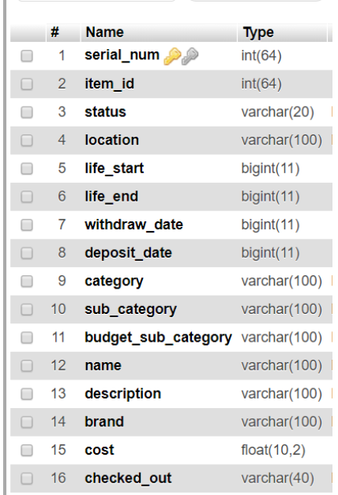
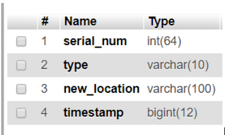

# Inventory Mangement API

# Schema:

Table 1: Inventory


 
serial_num is a unique value given to every single item in inventory. This can be used to track items history. Item_id is unique to all identical copies of items. So for example, if we have ten 50” Samsung tv’s that were purchased at the same time and entered into inventory, these would all have the same item_id, but different serial_num. 

status can be one of ‘available’, ‘inhome’, ‘checkedout’, 'lost/stolen', and ‘retired’.

life_start and life_end are timestamps representing when the product was first put into inventory, and the due date of when its expected life will be up and it will enter retirement.

withdraw_date and deposit_date, track the most recent events of the item moving to or from inventory.

Table 2: Transactions


This table holds individual transactions that are made to or from inventory. The schema is very simple, each item that enters/leaves inventory will be required with its serial_num, the type of transaction (withdraw, or deposit), the new location, and a timestamp of the transaction.


# API:

## URL
Test it live here:
```
https://inventory.authenticated-services.com/
```

### IMPORTANT
To use this api, you must set the authorization header to an api key.

## Endpoints

```
/*
Retreives a list of unique items by serial_id 
  Params: (optional)
  - serial_num 

  Query Params: (optional)
  - status 
  - location
  - item_id
*/

GET /items/:serial_num
```
Example:
```
// All items that are currently at location "loc123"
GET https://inventory.authenticated-services.com/items/?location=loc123

// item with serial number 1002
GET https://inventory.authenticated-services.com/items/1002
```
<hr />

```
/*
Retreives a list of items grouped by item_id
  Params: (optional)
  - item_id 

  Query Params: (optional)
  - status 
  - location
*/

GET /stock/:item_id 
```

Example:
```
// All items that are currently available for check out and the current quantities available
GET https://inventory.authenticated-services.com/stock/?status=available

// items in with item_id=1
GET https://inventory.authenticated-services.com/items/1
```
<hr />

```
/*
Retreives the history of a specific item
  Params: (required)
  - serial_num 
*/
GET '/history/:serial_num
```

Example:
```
// returns the history of item 1002
GET https://inventory.authenticated-services.com/history/1002
```
<hr />

```
/*
Places a specific item into a user's cart
  Params: (required)
  - serial_num 

  Query Params: (required)
  - user_id 
*/
POST /checkout/:serial_num
```

Example:
```
// places item 1002 into the cart of user 666
POST https://inventory.authenticated-services.com/checkout/1002?user_id=666
```
<hr />

```
/*
Gets all items that are checked out by user
  Query Params: (required)
  - user_id 
*/
GET /checkout
```

Example:
```
// returns all items checked out by user 666
GET https://inventory.authenticated-services.com/checkout/?user_id=666
```
<hr />

```
/*
Withdraws from inventory
  Params: (required)
  - serial_num 

  Query Params: (required)
  - location 
*/
POST /withdraw/:serial_num
```

Example:
```
// returns all items checked out by user 666
POST https://inventory.authenticated-services.com/withdraw/1002?location=loc123
```
<hr />

```
/*
Deposists into inventory
  Params: (required)
  - serial_num 
*/
POST /deposit/:serial_num
```

Example:
```
// returns all items checked out by user 666
POST https://inventory.authenticated-services.com/deposits/1002
```
<hr />

Try the API here : https://inventory.authenticated-services.com/

Remember to set the authorization header.

# What I would do next:
- Sanitize user input to prevent SQL injection
- uri encoding/decoding better handling of query params
- Validate that correct query params are received
- Add filtering and ordering 
- split endpoints into a more restful file layout
- cleanup code and functions
  
